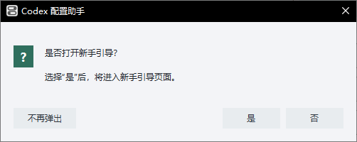
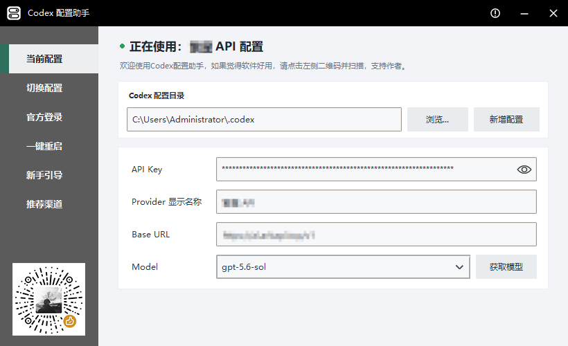
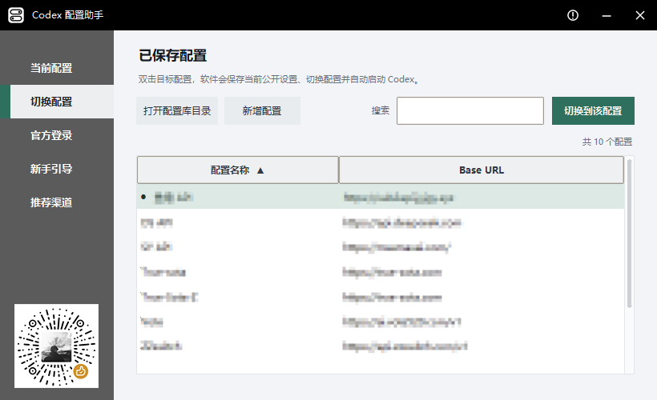
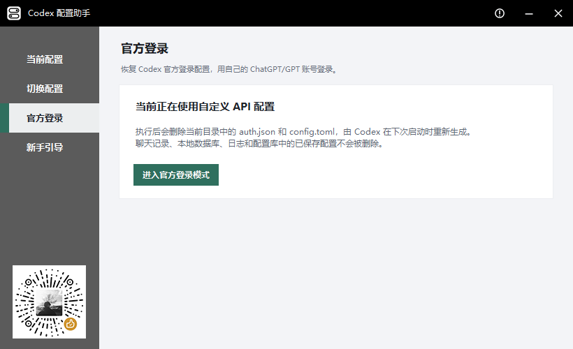
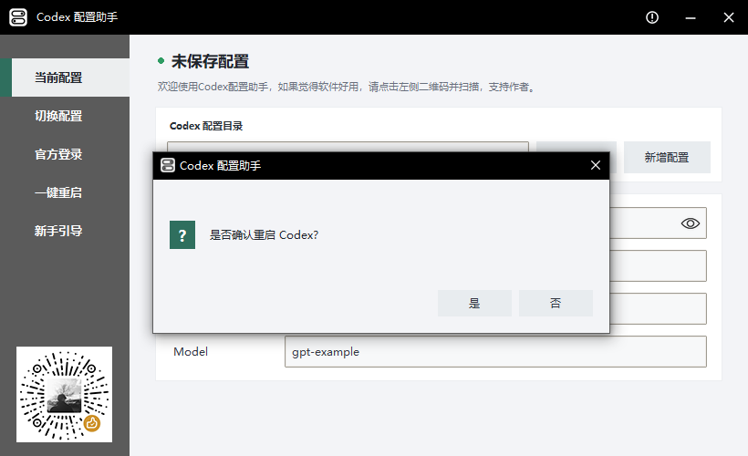
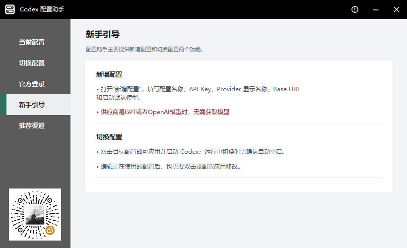
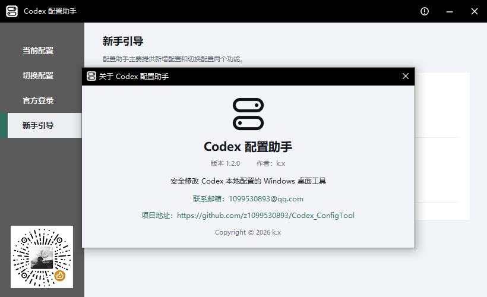
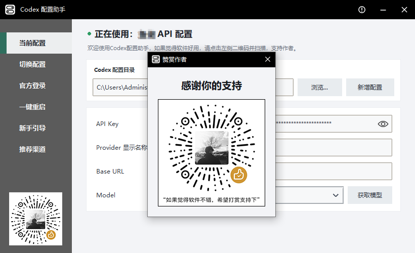

# Codex 配置助手

Codex 配置助手 `1.3.0` 是一个 Windows 桌面工具，用于管理和切换多个 Codex 配置。程序使用 Python 标准库、Tkinter 和 PyInstaller，不联网，也不会上传 API Key。

## 下载

前往 [GitHub Releases](https://github.com/z1099530893/Codex_ConfigTool/releases/latest) 下载最新版 `CodexConfigTool-v1.3.0.exe`。程序为单文件版本，无需安装。

## 功能

- 自动识别、手动选择 Codex 配置目录
- 读取和编辑 API Key、Provider 显示名称、Base URL 和 Model
- 长 API Key 支持平滑滚轮浏览、键盘定位和越界拖选
- API Key 等配置文件绝不上传，保护隐私
- 新增配置并保存到配置库
- 在配置库中搜索、排序、切换、完整编辑、删除配置
- 双击“配置名称”即可切换到该配置
- 支持右键菜单、全选、Ctrl+A 和鼠标左键拖选批量操作
- 多选状态右键只提供批量删除，不提供无意义的单项编辑
- 配置永久保留，不设数量上限，不会自动删除或更新时间
- 当前配置只读展示，切换配置不弹出保存或确认窗口
- 官方登录模式和启动新手引导询问
- 左侧一键启动或重启 Codex，并在执行前进行确认
- Windows 单实例限制，避免多个窗口交叉修改配置
- 配置与设置采用原子写入，双文件保存失败时自动恢复原内容
- 配置签名和搜索信息按文件状态缓存，配置变化后自动失效
- 固定 `820 × 500` 窗口、扁平化界面、深色自定义标题栏和 Windows 任务栏动画

## 界面预览

### 首次启动

启动时可以直接进入软件、打开新手引导，或选择以后不再显示提示。

<p align="center">
  
</p>

### 当前配置

“当前配置”页面只读展示正在使用的配置名称、API Key、Provider 显示名称、Base URL 和 Model。API Key 默认隐藏，可以使用输入框中的眼睛图标切换显示。页面上方可以浏览 Codex 配置目录，也可以基于当前配置新增配置。



### 切换配置

“切换配置”页面按配置名称和 Base URL 展示配置库。绿色圆点表示当前配置；可以搜索、排序、编辑、删除或切换配置，并支持右键菜单、全选、`Ctrl+A` 和鼠标左键拖选；双击“配置名称”即可切换到该配置。



### 官方登录

“官方登录”用于恢复 Codex 官方登录模式。确认后只删除当前目录中的 `auth.json` 和 `config.toml`，聊天记录、本地数据库、日志和配置库都会保留。



### 一键重启 Codex

左侧“一键重启”可以在配置调整完成后启动或重新启动 Codex，无需手动查找和结束进程。Codex 已运行时，按钮会请求正常关闭，等待其保存“跟随系统”等界面设置后再重新启动；Codex 未运行时，按钮会直接启动已安装的 Codex。只有 Codex 长时间无响应时才会强制结束进程。



### 新手引导

新手引导分别说明“新增配置”和“切换配置”两个核心流程，左侧导航可以随时重新打开。



### 关于软件与赞赏作者

右上角的关于按钮可以查看版本、作者、联系方式和项目地址；点击左下角赞赏码可以查看大图。

<table>
  <tr>
    <td align="center"><strong>关于软件</strong></td>
    <td align="center"><strong>赞赏作者</strong></td>
  </tr>
  <tr>
    <td></td>
    <td></td>
  </tr>
</table>

## 配置库

配置库位于当前 Codex 目录的 `backups/` 子目录，每个配置使用以下目录格式：

```text
yyyyMMdd-HHmmss-配置名称/
```

目录中保存 `auth.json` 和 `config.toml`。配置名称不区分大小写且必须唯一。保存内容与已有配置核心内容一致时复用已有配置，不创建重复目录；切换配置只复制目标配置，不修改配置库内容和时间。

删除配置只删除 `backups/` 中的已保存记录，不修改当前 Codex 目录中的 `auth.json` 和 `config.toml`。如果删除了与当前内容匹配的配置，Codex 仍继续使用当前文件，主界面状态改为“未保存配置”。

新增配置会先复制当前配置的 `auth.json` 和 `config.toml`，再只修改 API Key、Provider 显示名称、Base URL 和 Model。这样可以保留 Codex 身份字段以及其他桌面状态，避免保存并使用新配置后被识别为新的 Codex 身份。当前目录没有配置文件时才会使用新模板。

普通保存只修改以下字段：

- `auth.json` 中的 `OPENAI_API_KEY`
- 当前 Provider 段的 `name`
- 当前 Provider 段的 `base_url`
- 顶层 `model`

程序不会修改聊天记录、SQLite 数据库、日志或未涉及的 Codex 桌面状态。普通编辑不会修改现有配置的 `model_provider` 或 Provider 段名；只有当前配置是内置 openai 且需要新增自定义 Provider 时，才会保留其他内容并添加新的 Provider 段。无法安全识别的复杂配置会停止处理并提示用户。

写入 `auth.json`、`config.toml` 和工具设置时，程序会先在目标目录写入并同步临时文件，再通过 `os.replace` 原子替换。保存两份核心配置时任一步骤失败，程序会恢复操作前的两份文件。配置库签名和列表搜索信息最多缓存 512 个目录，并依据文件是否存在、大小、纳秒修改时间和创建时间自动失效。

## 新手引导

启动时会弹出确认窗口询问是否打开新手引导。选择“是”进入“新手引导”页面，选择“否”直接进入软件；在明确点击“不再弹出”前，每次启动都会继续询问。点击“不再弹出”后记录在 `%APPDATA%\CodexConfigTool\settings.json`，以后不再自动弹出。左侧“新手引导”页面可随时查看。

## 运行

环境要求：Windows、Python 3.10 或更高版本。

```powershell
python codex_config_tool.py
```

本项目运行时只依赖 Python 标准库。

## 测试

```powershell
python -m py_compile codex_config_tool.py
python -m unittest discover -s tests -q
```

测试使用临时配置目录，不应读取或修改真实用户的 `.codex`。测试包含写入/替换故障注入、事务回滚和缓存失效检查。

## 打包

关闭正在运行的程序后执行：

```bat
scripts\build.bat
```

或：

```powershell
.\scripts\build.ps1
```

产物位于 `dist/CodexConfigTool.exe`。`version_info.txt` 会写入 Windows 文件版本、产品名称和说明。源码仓库只提交源码、文档、测试、构建脚本和图片资源；`.exe` 应作为 GitHub Release 附件发布，不提交到源码仓库。

## 文件结构

```text
codex_config_tool.py   主程序
tests/                 标准库测试
assets/               图片、图标和赞赏码
scripts/              构建脚本和测试补丁脚本
docs/                 项目说明、交接文档和变更记录
docs/images/          README 使用的界面截图
CodexConfigTool.spec   PyInstaller 配置
version_info.txt       Windows EXE 版本资源
```

## 联系

- 作者：k.x
- 邮箱：1099530893@qq.com
- 项目：https://github.com/z1099530893/Codex_ConfigTool

## 重置“新手引导”弹窗提示

“新手引导”弹窗一旦被禁用就不再弹出，为了方便开发测试，开发者可以运行“ scripts/reset_onboarding.bat ”脚本，该脚本可以重置这个弹窗，并且可以放在任意目录运行，脚本只开启弹窗，其余所有工具设置将被保留。运行后关闭并重新启动 Codex Config Tool，即可再次显示“新手引导”。
