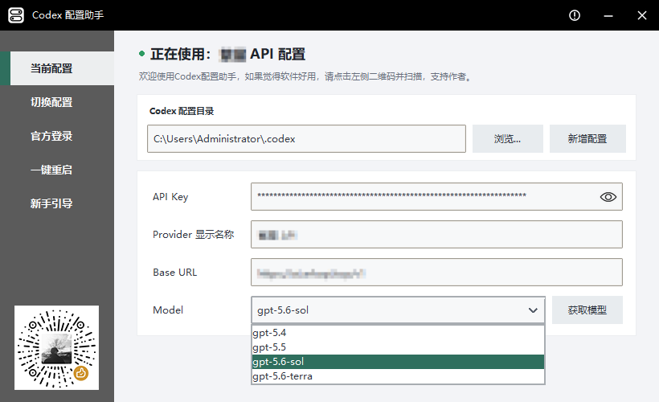
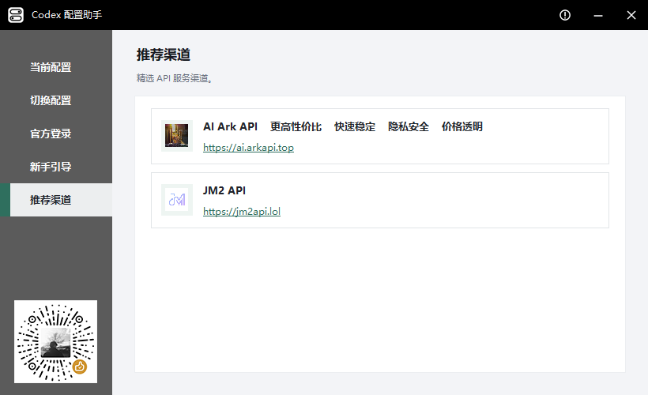

# Codex 配置助手

Codex 配置助手 `1.5.0` 是一个 Windows 桌面工具，用于管理和切换多个 Codex 配置。程序使用 Python 标准库，界面由 Tkinter 或 PySide6（Qt）提供，使用 PyInstaller 打包。启动时会访问 GitHub Release 检查新版本；只有用户主动点击“获取模型”时，才会将 API Key 发送到用户填写的 Base URL，API Key 不会发送到 GitHub 或其他服务。

## 下载

前往 [GitHub Releases](https://github.com/z1099530893/Codex_ConfigTool/releases/latest) 下载最新版。同一个版本提供两种前端，功能与界面完全一致，区别只在窗口渲染方式：

| 文件 | 前端 | 说明 |
| --- | --- | --- |
| `CodexConfigTool-Qt-Setup-v1.5.0.exe` | Qt | **推荐**。修复了从任务栏恢复窗口时的闪烁，约 54 MB |
| `CodexConfigTool-Qt-Portable-v1.5.0.exe` | Qt | 便携版，无需安装 |
| `CodexConfigTool-Setup-v1.5.0.exe` | Tk | 体积小（约 13 MB），仍存在恢复时的闪烁 |
| `CodexConfigTool-Portable-v1.5.0.exe` | Tk | 便携版，无需安装 |

两种前端共用同一个安装标识和安装目录，安装其中一个会替换另一个，不会并存。

本版变更详见 [发布说明](docs/RELEASE_NOTES_1.5.0.md)，全部已知缺陷及其状态见 [问题台账](docs/ISSUE_LEDGER.md)。

安装包默认安装到当前用户目录，不要求管理员权限，并创建开始菜单入口。桌面快捷方式默认勾选，也可以在安装时取消。卸载时可以选择“保留用户数据”或“完全删除用户数据”；后者只删除配置助手设置和 `.codex\\backups` 配置库，不删除当前配置、API Key、会话或聊天记录。

请勿使用第三方卸载工具清理 Codex 相关“残留”：它可能误将 `%APPDATA%\\Codex` 和 `%LOCALAPPDATA%\\Codex` 识别为配置助手文件。配置助手自身数据目录仅为 `%APPDATA%\\CodexConfigTool`。

## 功能

- 自动识别、手动选择 Codex 配置目录
- 在新增、编辑配置时填写 API Key、Provider 显示名称、Base URL 和启动默认模型
- 在新增、编辑配置时从供应商的 OpenAI 兼容 `/models` 接口获取可用模型，支持下拉选择和手动输入
- OpenAI 原生配置不生成配置助手模型目录，模型版本、显示方式和推理强度由 Codex 原生能力管理；第三方 Provider 继续保存获取到的模型列表
- 长 API Key 支持平滑滚轮浏览、键盘定位和越界拖选
- API Key 等配置文件绝不上传，保护隐私
- 新增配置并保存到配置库
- 在配置库中搜索、排序、切换、完整编辑、删除配置
- 双击配置列表中的任意有效行区域即可切换到该配置
- 支持右键菜单、全选、Ctrl+A 和鼠标左键拖选批量操作
- 多选状态右键只提供批量删除，不提供无意义的单项编辑
- 配置永久保留，不设数量上限，不会自动删除或更新时间
- 当前配置页只读展示实际正在使用的连接信息和启动默认模型
- 官方登录模式和启动新手引导询问
- 双击配置统一完成应用与 Codex 生命周期处理；通过 Windows 正式应用入口启动，并确认新主进程和窗口
- 启动时自动检查 GitHub Release；发现新版本后仅在关于图标显示红点，不弹窗、不自动下载
- Windows 单实例限制，避免多个窗口交叉修改配置
- 配置与设置采用原子写入，双文件保存失败时自动恢复原内容
- 配置签名和搜索信息按文件状态缓存，配置变化后自动失效
- 固定 `820 × 500` 窗口、扁平化界面、深色自定义标题栏和 Windows 任务栏动画
- 提供 Tk 与 Qt 两种前端，功能与界面完全一致，共用同一份配置和设置，可随时换用

## 界面预览

### 首次启动

启动时可以直接进入软件、打开新手引导，或选择以后不再显示提示。

<p align="center">
  
</p>

### 当前配置

“当前配置”页面只读展示实际正在使用的配置名称、API Key、Provider 显示名称、Base URL 和启动默认模型，不再提供模型获取、下拉选择或手动编辑。API Key 默认隐藏，可以使用输入框中的眼睛图标切换显示。需要改变某个配置的启动默认模型时，请在“切换配置”页面编辑该配置并保存，然后双击配置应用；页面上方仍可浏览 Codex 配置目录，也可以基于当前配置新增配置。


### 新增与编辑配置

新增和编辑窗口继续提供启动默认模型的手动输入、下拉选择和“获取模型”。使用 OpenAI/Codex 原生 Provider 时不需要点击“获取模型”：模型版本、显示名称和推理强度由 Codex 原生能力管理，直接填写启动默认模型并保存即可。“获取模型”只用于第三方 OpenAI 兼容 Provider，获取结果先保留在编辑事务中，只有点击“保存配置”或“保存修改”时，连接信息、启动默认模型和完整模型列表才会一起原子写入配置库；取消不会落盘。保存不会立即应用到当前 `.codex`，也不会启动或重启 Codex。

> **重要：供应商是GPT或者OpenAI模型时，无需获取模型。**

保存后返回“切换配置”页面，双击该配置才会应用并启动 Codex。编辑当前活动配置后会显示为待应用：Codex 未运行时双击会应用并启动；Codex 正在运行时双击会先确认，再正常退出、应用并重新启动。新增和编辑窗口不再提供“保存并使用”或“保存并应用”。



### 切换配置

“切换配置”页面按配置名称和 Base URL 展示配置库。绿色圆点表示当前配置；可以搜索、排序、编辑、删除或切换配置，并支持右键菜单、全选、`Ctrl+A` 和鼠标左键拖选；双击配置名称、Base URL 或同一行空白区域均可应用该配置。双击当前配置也有明确行为：Codex 未运行时启动，存在待应用编辑时先应用；Codex 已运行且没有待应用编辑时不重复重启，只提示已经运行。

每个配置保存自己的启动默认模型和默认推理强度。双击目标配置时，如果 Codex 正在运行，配置助手会先征求确认，再调用 Codex 自身的正常退出流程；确认旧实例完全结束后，才把公开 `config.toml` 中的最新模型和推理强度保存回原配置、应用目标配置并从 Windows 正式入口重新启动 Codex。切换期间重复操作无效，退出失败时零写入，配置投影失败时恢复原配置。只保存在某个对话内部的临时状态不会被读取或写回，软件不会修改 Codex 的私有对话数据库。


### 官方登录

“官方登录”用于切换到 Codex 官方登录模式。确认后只移除当前配置中的 API Key，并切换到官方 `openai` Provider；不会删除 `auth.json`、`config.toml`、聊天记录或会话数据，之后可随时切回已保存的 API 配置。


### 配置切换与自动启动

配置切换统一使用 Codex 的正常退出和 Windows 正式启动入口，左侧不再提供独立的“一键重启”。正常退出会恢复并核验 Codex 窗口，再发送应用自身注册的 `Ctrl+Q`；确认完全结束后清理 Store 版固定托盘 GUID 的残留注册，并通过真实 AUMID 的 AppsFolder 入口重新启动，不使用强制结束。启动完成后仍需保留主窗口、任务栏图标、系统托盘图标及托盘右键退出菜单。

### 新手引导

新手引导分别说明“新增配置”和“切换配置”两个核心流程，左侧导航可以随时重新打开。


### 推荐渠道

侧栏“推荐渠道”提供 AI Ark API 和 JM2 API 服务入口，点击对应地址即可使用系统默认浏览器打开 `https://ai.arkapi.top` 或 `https://jm2api.lol`。



### 关于软件与赞赏作者

右上角的关于按钮可以查看版本、作者、联系方式和项目地址，并可手动检查软件更新；点击左下角赞赏码可以查看大图。软件启动后会在后台检查 GitHub 最新 Release：发现新版本时只在关于图标右上角显示红点，不弹窗；进入关于窗口后可主动打开下载页。软件不会自动下载、安装或替换 EXE。

<table>
  <tr>
    <td align="center"><strong>关于软件</strong></td>
    <td align="center"><strong>赞赏作者</strong></td>
  </tr>
  <tr>
    <td></td>
    <td></td>
  </tr>
</table>

## 配置库

官方登录与 API 配置切换采用非破坏性合并：官方模式只移除 `OPENAI_API_KEY`，保留 `config.toml`、ChatGPT 登录令牌和全部会话数据；切回 API 配置时只更新 Provider、Base URL、Model 与 API Key，不覆盖会话期间产生的字段。

配置库位于当前 Codex 目录的 `backups/` 子目录，每个配置使用以下目录格式：

```text
yyyyMMdd-HHmmss-配置名称/
```

目录中保存 `auth.json`、`config.toml`，以及存在时由配置助手管理的模型目录。配置名称不区分大小写且必须唯一。新增和编辑只更新配置库；获取到的模型列表与配置在同一保存事务中落盘。双击配置时才同步原活动配置的公开启动默认值并应用目标配置。

删除配置只删除 `backups/` 中的已保存记录，不修改当前 Codex 目录中的 `auth.json` 和 `config.toml`。如果删除了与当前内容匹配的配置，Codex 仍继续使用当前文件，主界面状态改为“未保存配置”。

新增配置会先复制当前配置的 `auth.json` 和 `config.toml`，再只修改 API Key、Provider 显示名称、Base URL 和启动默认模型。这样可以保留 Codex 身份字段以及其他桌面状态；保存后仍需双击配置才会应用，当前目录没有配置文件时才会使用新模板。

普通保存只修改以下字段：

- `auth.json` 中的 `OPENAI_API_KEY`
- 当前 Provider 段的 `name`
- 当前 Provider 段的 `base_url`
- 顶层 `model`

程序不会修改聊天记录、SQLite 数据库、日志或未涉及的 Codex 桌面状态。普通编辑不会修改现有配置的 `model_provider` 或 Provider 段名；只有当前配置是内置 openai 且需要新增自定义 Provider 时，才会保留其他内容并添加新的 Provider 段。无法安全识别的复杂配置会停止处理并提示用户。

“获取模型”只存在于新增和编辑配置窗口，也是唯一主动发起的供应商网络请求。OpenAI 原生配置不需要执行此操作，也不会生成或写入配置助手模型目录；第三方 Provider 的请求使用窗口中的 Base URL 与 API Key、最多等待 8 秒、限制响应大小并禁止跨地址重定向，以免 API Key 被转发到其它地址。获取成功只更新当前编辑事务中的候选列表；点击保存后才与配置一起落盘。供应商不支持标准 `/models` 接口、请求失败或用户取消时，配置库和当前配置都保持不变。

写入 `auth.json`、`config.toml` 和工具设置时，程序会先在目标目录写入并同步临时文件，再通过 `os.replace` 原子替换。保存两份核心配置时任一步骤失败，程序会恢复操作前的两份文件。配置库签名和列表搜索信息最多缓存 512 个目录，并依据文件是否存在、大小、纳秒修改时间和创建时间自动失效。

## 新手引导

启动时会弹出确认窗口询问是否打开新手引导。选择“是”进入“新手引导”页面，选择“否”直接进入软件；在明确点击“不再弹出”前，每次启动都会继续询问。点击“不再弹出”后记录在 `%APPDATA%\CodexConfigTool\settings.json`，以后不再自动弹出。左侧“新手引导”页面可随时查看。

## 运行

环境要求：Windows、Python 3.10 或更高版本。

```powershell
python codex_config_tool.py
```

本项目运行时只依赖 Python 标准库。

### Qt 前端（可选）

仓库里还有一份功能完全相同、界面完全相同的 Qt 前端：

```powershell
pip install "PySide6>=6.8,<6.12"
python codex_config_qt.py
```

它复用 `codex_config_tool.py` 的全部业务逻辑（配置读写、配置库、进程处理、更新检查等），只重写视图层。注意该模块会导入 `tkinter`，因此所用解释器需要**同时**具备 `PySide6` 和 `tkinter`。

**为什么会有两个前端**：从任务栏恢复窗口时，Tk 前端的主界面会闪一下——顶层窗口先被呈现、内容后绘制，中间 1-3 帧由合成器用窗口自身的背景色填充。Tk 的顶层窗口没有 backing store，把整个视图压到一个 `Canvas` 只能减少约三分之一、无法消除。Qt 的顶层窗口两者兼备，实测同样 8 轮最小化/恢复中 **0 帧空白**。原因、测量方法与数据见 `AGENT_HANDOFF_WINDOW_BUGS.md`，可复现的测量工具在 `prototypes/`。

### 打包 Qt 前端

```bat
scripts\build_qt.bat
```

产物是 `dist\CodexConfigTool-Qt.exe`（约 51 MB），**不会覆盖** `dist\CodexConfigTool.exe`。两者并存是刻意的：Tk 版是回滚产物，构建脚本会在结束时核对 Tk 产物的哈希，一旦被改动就报错。

体积明显大于 Tk 版的 12.6 MB，原因有两条，都不是可以省掉的：需要打包 Qt 运行时；而且 `codex_config_tool.py` 在模块顶层 `import tkinter`，Qt 前端把它整个当作库导入，所以连 tkinter 与 tcl/tk 也一并打包。这是“共用业务逻辑”这个架构的直接代价。

`scripts\build_qt.ps1` 会显式挑选同时具备 PySide6、tkinter、PyInstaller 的解释器，而不是信任 PATH 上的第一个 `python`——本机 PATH 上的那个没有 tkinter，跑不起本项目。

## 测试

```powershell
python -m py_compile codex_config_tool.py codex_config_qt.py
python -m unittest discover -s tests -q
```

测试使用临时配置目录，不读取或修改真实用户的 `.codex`。测试覆盖写入故障注入、事务回滚、缓存失效、模型目录、配置切换生命周期、官方登录会话保护和安装包数据边界。当前为 **124 项**，全部通过。

窗口相关的结论**不能只看测试**：本项目为此维护了一套可复现的测量工具（`prototypes/`）和一份完整的调查记录（`AGENT_HANDOFF_WINDOW_BUGS.md`），改动窗口、任务栏或系统托盘代码前请先读它们。

## 打包

关闭正在运行的程序并安装 Inno Setup 6 后，执行统一打包入口：

```bat
scripts\build.bat
```

该脚本一次生成**四个**发布资产——两种前端各自的便携版与安装版：

| 文件 | 前端 |
| --- | --- |
| `dist\CodexConfigTool-Portable-v<版本>.exe` | Tk |
| `dist\CodexConfigTool-Setup-v<版本>.exe` | Tk |
| `dist\CodexConfigTool-Qt-Portable-v<版本>.exe` | Qt |
| `dist\CodexConfigTool-Qt-Setup-v<版本>.exe` | Qt |

完成或失败时命令行窗口会保留并显示结果，成功时逐个输出字节数与 SHA-256。开发者如需单独调用底层流程：

```powershell
.\scripts\build_installer.ps1          # 四个资产
.\scripts\build.ps1                    # 只出 Tk 便携版
.\scripts\build_qt.ps1                 # 只出 Qt 便携版
.\scripts\build_installer.ps1 -SkipBuild -SkipQt   # 只重打 Tk 安装包
```

`version_info.txt` 会写入 Windows 文件版本、产品名称和说明。安装器定义 `packaging\CodexConfigTool.iss` 通过 ISPP 参数复用：`build_installer.ps1` 调用 ISCC 两次，分别以 `/DMyAppExeName=CodexConfigTool.exe` 和 `/DMyAppExeName=CodexConfigTool-Qt.exe /DMyAppOutputSuffix=-Qt` 传入。两种前端共用同一个 `AppId`、`AppMutex` 和安装目录，它们是同一个应用的两个前端而不是两个应用，因此安装器带一个 `[InstallDelete]` 段，换前端安装时清掉另一个前端的 EXE。

源码仓库只提交源码、文档、测试、构建脚本和图片资源；生成的 EXE 应作为 GitHub Release 附件发布，不提交到源码仓库。

## 文件结构

```text
codex_config_tool.py           主程序（Tk 前端 + 全部业务逻辑）
codex_config_qt.py             Qt（PySide6）前端，复用上面的业务逻辑
CodexConfigTool.spec           Tk 版 PyInstaller 配置
CodexConfigTool-Qt.spec        Qt 版 PyInstaller 配置（build_qt.ps1 必需）
prototypes/                    闪烁问题的测量工具与原型（见其 README）
tests/                         标准库测试
assets/                        图片、图标和赞赏码
scripts/                       构建脚本和测试补丁脚本
packaging/                     Inno Setup 安装包定义
docs/                          项目说明、交接文档和变更记录
docs/ISSUE_LEDGER.md           全部已知缺陷及其状态
docs/RELEASE_NOTES_1.5.0.md    本版发布说明
docs/ai/                       开发过程记录（变更请求、开发日志、验收与发布报告）
docs/images/                   README 使用的界面截图
AGENT_HANDOFF_WINDOW_BUGS.md   窗口问题的完整调查记录（改窗口代码前先读）
version_info.txt               Windows EXE 版本资源
```

`.gitignore` 有意排除以下内容，它们都是本地安全网或可再生产物，不进入仓库：`build/`、`dist/`、`backups/`（约 95 MB 的回滚快照与历史 EXE）、`prototypes/out/`（约 33 MB 的截图与测量报告，重跑探针即可再生）、`.workbuddy-ai/`，以及误展开的 `%SystemDrive%/` 目录。

## 联系

- 作者：k.x
- 邮箱：1099530893@qq.com
- 项目：https://github.com/z1099530893/Codex_ConfigTool

## 重置“新手引导”弹窗提示

“新手引导”弹窗一旦被禁用就不再弹出，为了方便开发测试，开发者可以运行“ scripts/reset_onboarding.bat ”脚本，该脚本可以重置这个弹窗，并且可以放在任意目录运行，脚本只开启弹窗，其余所有工具设置将被保留。运行后关闭并重新启动 Codex Config Tool，即可再次显示“新手引导”。
